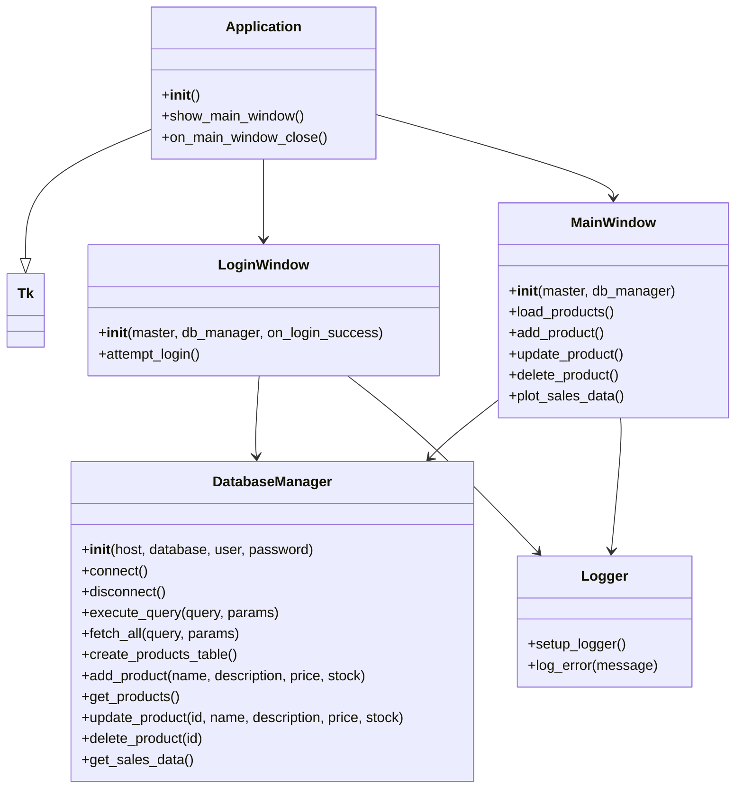

# Documentação do Projeto: Perucas Diferentonas

## 1. Introdução

Este documento detalha o desenvolvimento de uma aplicação desktop para gerenciamento de uma loja virtual de perucas "diferentonas". O objetivo principal é demonstrar a criação de uma aplicação Python utilizando a biblioteca Tkinter para a interface gráfica, MySQL para o gerenciamento de dados e Matplotlib para visualização de informações. A aplicação permite o cadastro, consulta, atualização e exclusão (CRUD) de produtos, além de apresentar um sistema de login e registro de erros.

## 2. Diagrama de Classes (UML Simplificado)



## 3. Explicação do Código (Principais Funções e Métodos)

O projeto é modularizado em quatro arquivos Python principais (`database.py`, `logger.py`, `gui.py`, `main.py`), cada um com responsabilidades bem definidas.

### `database.py`

Este módulo contém a classe `DatabaseManager`, responsável por toda a interação com o banco de dados MySQL.

*   `__init__(self, host, database, user, password)`: Construtor que inicializa as credenciais de conexão.
*   `connect()`: Estabelece a conexão com o banco de dados MySQL.
*   `disconnect()`: Fecha a conexão com o banco de dados.
*   `execute_query(query, params)`: Executa comandos SQL que modificam o banco de dados (INSERT, UPDATE, DELETE).
*   `fetch_all(query, params)`: Executa comandos SQL que retornam dados (SELECT).
*   `create_products_table()`: Cria a tabela `products` se ela não existir, com campos para `id`, `name`, `description`, `price` e `stock`.
*   `add_product(name, description, price, stock)`: Adiciona um novo produto à tabela.
*   `get_products()`: Retorna todos os produtos cadastrados.
*   `update_product(id, name, description, price, stock)`: Atualiza os dados de um produto existente.
*   `delete_product(id)`: Remove um produto da tabela.
*   `get_sales_data()`: Simula a obtenção de dados de vendas (neste caso, top 5 produtos por estoque) para o gráfico.

### `logger.py`

Este módulo implementa um sistema de log simples para registrar erros em um arquivo `error.log`.

*   `setup_logger()`: Configura o logger para escrever mensagens de erro no arquivo `error.log`.
*   `log_error(message)`: Registra uma mensagem de erro no log.

### `gui.py`

Este módulo define as classes para as janelas da interface gráfica do usuário (GUI) usando Tkinter.

*   **`LoginWindow(tk.Toplevel)`**:
    *   `__init__(self, master, db_manager, on_login_success)`: Inicializa a janela de login, recebendo o gerenciador de banco de dados e uma função de callback para sucesso no login.
    *   `attempt_login()`: Verifica as credenciais de login (atualmente "admin" / "admin") e, em caso de sucesso, chama `on_login_success`.

*   **`MainWindow(tk.Toplevel)`**:
    *   `__init__(self, master, db_manager)`: Inicializa a janela principal, que contém as funcionalidades de CRUD de produtos e o gráfico de vendas.
    *   `load_products()`: Carrega os produtos do banco de dados e os exibe em um widget de texto.
    *   `add_product()`, `update_product()`, `delete_product()`: Métodos que interagem com o `DatabaseManager` para realizar as operações CRUD, utilizando `simpledialog` para entrada de dados.
    *   `plot_sales_data()`: Gera e exibe um gráfico de barras com os top 5 produtos em estoque usando Matplotlib.

*   **`Application(tk.Tk)`**:
    *   `__init__(self)`: Classe principal da aplicação. Inicializa o logger, o `DatabaseManager`, tenta conectar ao banco de dados e exibe a `LoginWindow`.
    *   `show_main_window()`: Chamada após o login bem-sucedido para exibir a `MainWindow`.
    *   `on_main_window_close()`: Lida com o fechamento da janela principal, desconectando do banco de dados.

### `main.py`

Este é o ponto de entrada da aplicação. Ele simplesmente cria uma instância da classe `Application` e inicia o loop principal do Tkinter.

## 4. Instruções para Execução

Para configurar e executar a aplicação, siga os passos abaixo:

### 4.1. Pré-requisitos

*   **Python 3.x** instalado.
*   **Servidor MySQL** em execução. Você pode usar XAMPP, WAMP, MAMP ou instalar o MySQL Server diretamente.

### 4.2. Configuração do Banco de Dados MySQL

1.  **Crie um banco de dados:** No seu servidor MySQL, crie um novo banco de dados. Por exemplo, `perucas_diferentonas_db`.
    ```sql
    CREATE DATABASE perucas_diferentonas_db;
    ```
2.  **Crie um usuário (opcional, mas recomendado):** Crie um usuário com permissões para acessar este banco de dados. Por exemplo, `root` com senha `password` (para ambiente de desenvolvimento).
    ```sql
    CREATE USER 'root'@'localhost' IDENTIFIED BY 'password';
    GRANT ALL PRIVILEGES ON perucas_diferentonas_db.* TO 'root'@'localhost';
    FLUSH PRIVILEGES;
    ```
3.  **Atualize as credenciais:** No arquivo `gui.py`, na classe `Application`, ajuste as credenciais do `DatabaseManager` se necessário:
    ```python
    self.db_manager = DatabaseManager("localhost", "perucas_diferentonas_db", "root", "password")
    ```

### 4.3. Instalação das Dependências Python

1.  Navegue até o diretório raiz do projeto no terminal.
2.  Instale as bibliotecas necessárias usando `pip` e o arquivo `requirements.txt`:
    ```bash
    pip install -r requirements.txt
    ```
    As dependências incluem `mysql-connector-python`, `matplotlib` e `numpy`.

### 4.4. Execução da Aplicação

1.  Após instalar as dependências e configurar o banco de dados, execute o arquivo `main.py`:
    ```bash
    python main.py
    ```
2.  A janela de login será exibida. Use `admin` como usuário e `admin` como senha para acessar a aplicação.
3.  A aplicação criará automaticamente a tabela `products` no banco de dados e adicionará alguns produtos de exemplo se a tabela estiver vazia.

## 5. Exemplos de Uso (Prints das Telas e Operações)

### 5.1. Janela de Login


### 5.2. Janela Principal (CRUD de Produtos e Gráfico)


### 5.3. Adicionar Produto


### 5.4. Atualizar Produto


### 5.5. Deletar Produto


### 5.6. Registro de Erros (`error.log`)

```
2025-09-29 10:30:05 - ERROR - Tentativa de login falhou para o usuário: usuario_errado
2025-09-29 10:35:10 - ERROR - Erro ao adicionar produto: 1048 (23000): Column 'name' cannot be null
```

---

**Autor:** Manus AI
**Data:** 29 de Setembro de 2025

